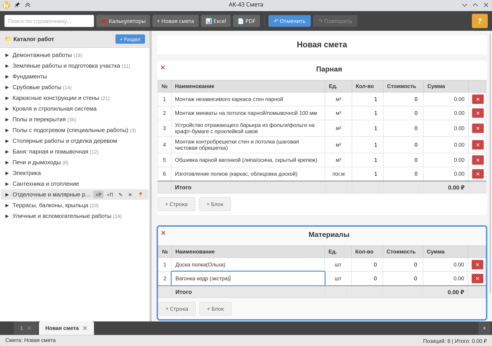
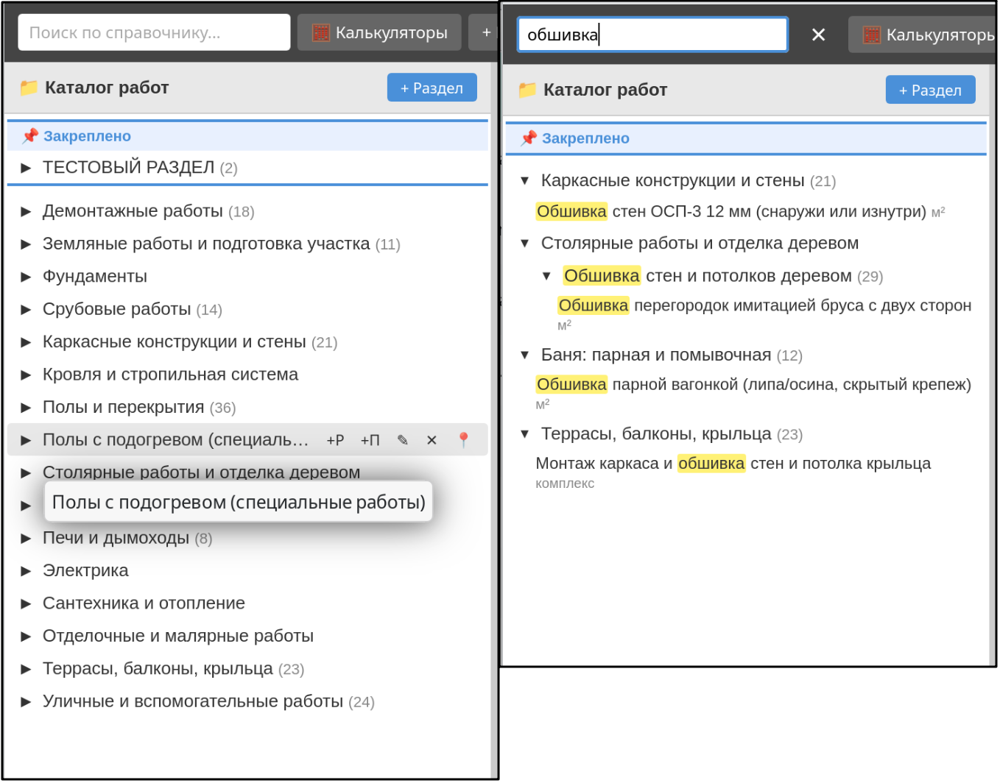
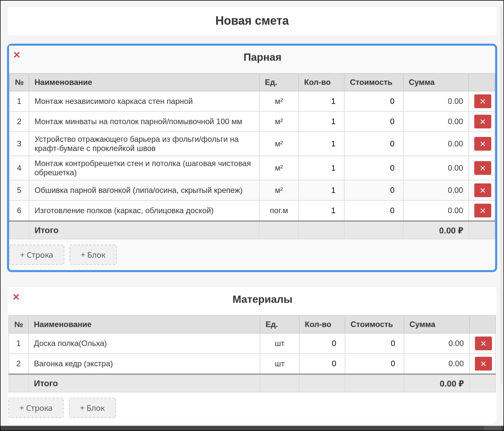
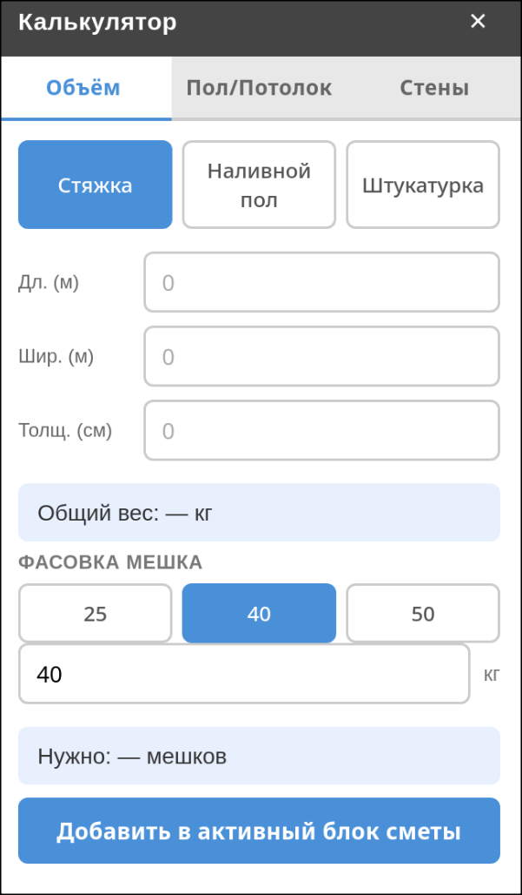

Быстрый старт:   
Скачать архив с программой    
Распаковать на диск или флэшку    
Запуск - ak43smeta-v1.0beta.exe

[📥 Скачать (Windows 10/11)](https://github.com/Makatukarianec/Ak43smeta/releases/latest)

Системные требования:   
Windows 10/11  
Не требует установки (портабельная версия)

 АК-43 Смета — надёжный инструмент для составления простых смет. Работает без интернета, не требует установки. Можно запускать прямо с флешки. Все данные сохраняются автоматически в папку программы.
---

Основная идея: вы один раз создаёте свой каталог работ, а затем собираете из него смету. Или собираете основные работы в раздел, и простым перетягиванием раздела мышкой, формируете смету. Готовую смету можно экспортировать в Excel (с формулами) или в PDF.

Каталог работ (левая часть окна)
-
· Редактируемый, с вложенностью до 5 уровней.

· Кнопка «+П» — добавить подраздел.

· Кнопка «+Р» — добавить работу.

· Любой раздел и подраздел можно закрепить вверху каталога (кнопка → «Закрепить»).

Поиск по каталогу
-
· Начните вводить название работы — каталог отфильтруется, совпадения подсветятся жёлтым. Поиск работает по мере ввода, достаточно нажать Ctrl + F и начать печатать.

Окно сметы (левая часть окна)
-
· Смета состоит из названия и блоков с работами.

· Добавить работу: перетащить мышью из каталога, либо двойной клик по работе.

· Добавить целый раздел: перетащить мышью, либо правый клик → «Добавить в смету».

· Работы добавляются в активный блок (выделен синим).

· У каждого блока — свой итог. Внизу — общая сумма по всем блокам.

· Все ячейки редактируются прямо в таблице, кроме столбца «Сумма» (считается автоматически).

Калькуляторы 
-
· Кнопка «Калькуляторы» открывает окно с расчётом объёмов и площадей (стяжка, штукатурка, стены, пол/потолок).

· Результат расчёта можно сразу добавить в активный блок сметы кнопкой «Добавить в смету».

Горячие клавиши
-
Клавиши Действие
Ctrl + F Поиск по каталогу

Ctrl + Z Отменить последнее действие в окне сметы (до 20 шагов)

Ctrl + Y Повторить отменённое действие в окне сметы (до 20 шагов)

Tab Перемещение между ячейками

Esc Отменить ввод

Вкладки смет
-
· Можно вести несколько смет одновременно. 
Вкладки находятся внизу окна. Их можно переименовывать двойным кликом прямо по вкладке,  добавлять и закрывать и перемещать мышью в панели вкладок.

Автосохранение
-
· Все изменения сохраняются автоматически. Ни чего не нужно нажимать. Данные хранятся в файлах внутри папки программы.

---

· Вопросы и предложения: makatukarianec@mail.ru

